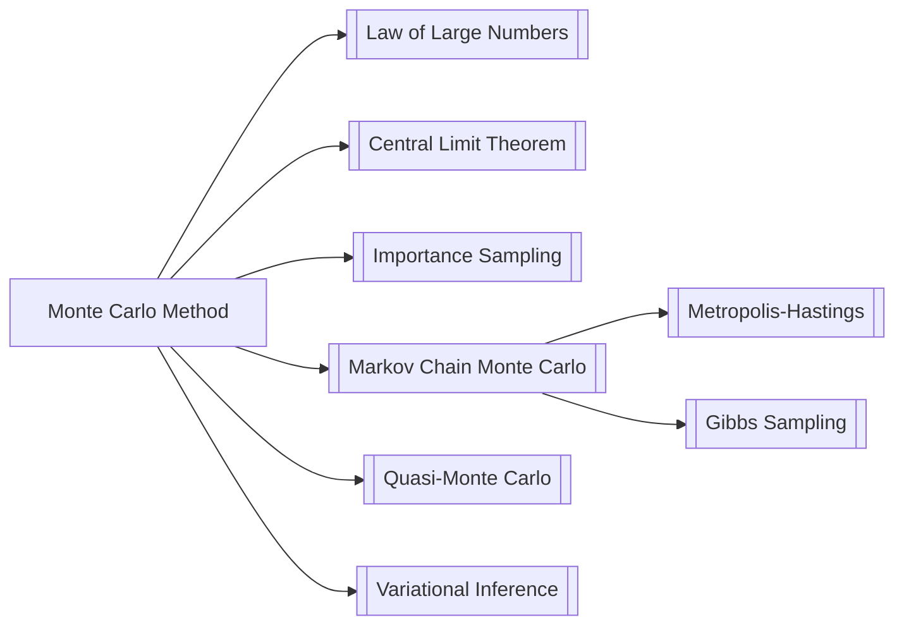

# Monte Carlo Method

## Definition

> **Definition** *(Monte Carlo Estimation).*
> Let $f : \mathcal{X} \to \mathbb{R}$ be a function and $p(x)$ a probability distribution over $\mathcal{X}$. We wish to compute the expectation
>
> $$
> \mu = \mathbb{E}_{x \sim p}[f(x)] = \int_{\mathcal{X}} f(x)\, p(x)\, dx.
> $$
>
> The **Monte Carlo estimator** draws $N$ i.i.d. samples $x^{(1)}, \dots, x^{(N)} \sim p$ and approximates $\mu$ by
>
> $$
> \hat{\mu}_N = \frac{1}{N} \sum_{i=1}^{N} f(x^{(i)}).
> $$

More broadly, **Monte Carlo methods** are a family of algorithms that use repeated random sampling to obtain numerical results — approximating quantities that may be deterministic but are difficult to compute analytically.

## Intuition

> [!note] Mental Model
> Think of Monte Carlo as "asking many random witnesses." If you want to know the fraction of a dartboard covered by a complicated shape, you throw darts randomly and count how many land inside. The fraction of hits converges to the true area. The quality of the answer improves with more darts — no matter the shape's complexity.
>
> Key insight: the convergence rate $O(1/\sqrt{N})$ is **independent of the dimension** of the problem. This makes Monte Carlo uniquely powerful in high dimensions, where grid-based quadrature suffers from the curse of dimensionality.

## Key Properties

- **Unbiasedness:** $\mathbb{E}[\hat{\mu}_N] = \mu$ — the estimator is unbiased for any finite $N$.
- **Consistency:** By the Law of Large Numbers, $\hat{\mu}_N \xrightarrow{a.s.} \mu$ as $N \to \infty$.
- **Convergence rate:** The standard error decays as $\sigma / \sqrt{N}$, where $\sigma^2 = \mathrm{Var}_{p}[f(x)]$. This $O(N^{-1/2})$ rate is dimension-free.
- **Asymptotic normality:** By the CLT, $\sqrt{N}(\hat{\mu}_N - \mu) \xrightarrow{d} \mathcal{N}(0, \sigma^2)$, enabling confidence intervals.
- **Variance reduction:** Techniques such as importance sampling, control variates, antithetic variates, and stratified sampling reduce $\sigma^2$ without changing $N$.

## Examples

### Example 1 — Estimating $\pi$

Sample $N$ points $(x_i, y_i)$ uniformly from $[-1,1]^2$. The fraction inside the unit circle estimates $\pi/4$:

$$
\hat{\pi} = \frac{4}{N} \sum_{i=1}^{N} \mathbf{1}\!\left[x_i^2 + y_i^2 \le 1\right] \xrightarrow{N\to\infty} \pi.
$$

### Example 2 — Monte Carlo Integration

For an integral $I = \int_a^b g(x)\,dx$, write $I = (b-a)\,\mathbb{E}_{U[a,b]}[g(x)]$ and estimate:

$$
\hat{I}_N = \frac{b-a}{N} \sum_{i=1}^{N} g(x^{(i)}), \quad x^{(i)} \sim \mathrm{Uniform}(a, b).
$$

### Example 3 — Importance Sampling

When direct sampling from $p$ is hard, or $f$ is concentrated in a low-probability region, sample from a proposal $q$ with $\mathrm{supp}(q) \supseteq \mathrm{supp}(p\cdot f)$:

$$
\mu = \mathbb{E}_{q}\!\left[\frac{p(x)}{q(x)} f(x)\right], \qquad \hat{\mu}^{\mathrm{IS}}_N = \frac{1}{N}\sum_{i=1}^N \frac{p(x^{(i)})}{q(x^{(i)})} f(x^{(i)}), \quad x^{(i)} \sim q.
$$

The optimal proposal is $q^*(x) \propto |f(x)|\,p(x)$, which zeroes the variance.

### Counter-example — High Variance Failure

If $f$ has heavy tails or $p$ and the integrand are poorly matched (e.g., $p/q$ has unbounded likelihood ratios in importance sampling), then $\sigma^2 = \infty$ and the CLT no longer applies. The estimator may converge extremely slowly or not at all in practice.

## Relation to Other Concepts

| Concept | Relation |
|---------|----------|
| [[Law of Large Numbers]] | Guarantees consistency of the estimator |
| [[Central Limit Theorem]] | Gives the $O(1/\sqrt{N})$ convergence rate and normality |
| [[Markov Chain Monte Carlo]] | Extends MC to intractable distributions via correlated samples |
| [[Importance Sampling]] | Variance-reduction technique; changes the sampling distribution |
| [[Quasi-Monte Carlo]] | Replaces pseudo-random samples with low-discrepancy sequences for $O(N^{-1}(\log N)^d)$ convergence |
| [[Variational Inference]] | Alternative to MC for approximate Bayesian inference |

## Theorems Involving This Concept

- [[Law of Large Numbers]] — ensures $\hat{\mu}_N \to \mu$ almost surely.
- [[Central Limit Theorem]] — $\sqrt{N}(\hat{\mu}_N - \mu) \xrightarrow{d} \mathcal{N}(0, \sigma^2)$; basis for error bars.
- **Hoeffding's Inequality** — if $f$ is bounded in $[a,b]$, then $\Pr(|\hat{\mu}_N - \mu| \ge \varepsilon) \le 2\exp\!\left(-\tfrac{2N^2\varepsilon^2}{N(b-a)^2}\right)$.
- **Koksma–Hlawka Inequality** — bounds Quasi-Monte Carlo error via the discrepancy of the point set and the variation of $f$.

## Notation

| Symbol | Meaning |
|--------|---------|
| $N$ | Number of Monte Carlo samples |
| $p(x)$ | Target / sampling distribution |
| $q(x)$ | Proposal distribution (importance sampling) |
| $w(x) = p(x)/q(x)$ | Importance weight |
| $\hat{\mu}_N$ | Monte Carlo estimator of $\mu$ |
| $\sigma^2$ | Variance of $f(x)$ under $p$; controls estimator variance |
| $\mathbf{1}[\cdot]$ | Indicator function |

## References

- Metropolis, N. & Ulam, S. (1949). *The Monte Carlo Method.* JASA, 44(247), 335–341.
- Robert, C. P. & Casella, G. (2004). *Monte Carlo Statistical Methods.* Springer.
- Owen, A. B. (2013). *Monte Carlo Theory, Methods and Examples.* (available online)
- Goodfellow, I., Bengio, Y. & Courville, A. (2016). *Deep Learning*, Chapter 17. MIT Press.

---
*Created: 2026-04-14*
