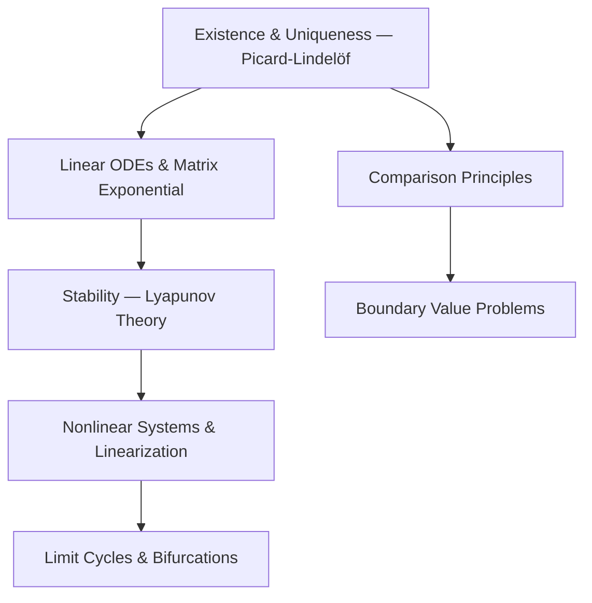

# ODE MOC

> Map of Content — **Ordinary Differential Equations**

## Subareas

- First-order ODEs
- Linear Systems
- Stability Theory (Lyapunov)
- Dynamical Systems & Phase Portraits
- Boundary Value Problems

---

## Foundations



---

## Core Concepts

```dataview
TABLE topic, status
FROM "01_Concepts"
WHERE area = "ODEs"
SORT file.name ASC
```

## Key Theorems & Results

```dataview
TABLE topic, source, status
FROM "04_Foundations"
WHERE area = "ODEs"
SORT file.name ASC
```

## Papers

```dataview
TABLE authors, year, status, rating
FROM "02_Papers"
WHERE area = "ODEs"
SORT year DESC
```

## Open Problems

```dataview
TABLE difficulty, status
FROM "03_Projects"
WHERE area = "ODEs"
SORT status ASC
```

## Key Topics to Cover

- [ ] Picard-Lindelöf theorem and its proof
- [ ] Gronwall's inequality
- [ ] Linear systems: $\dot{x} = Ax$, matrix exponential $e^{At}$
- [ ] Floquet theory for periodic systems
- [ ] Lyapunov stability, asymptotic stability
- [ ] Stable/unstable manifold theorem
- [ ] Poincaré-Bendixson theorem
- [ ] Sturm-Liouville problems

## Key References

- Hartman — *Ordinary Differential Equations*
- Coddington & Levinson — *Theory of ODEs*
- Perko — *Differential Equations and Dynamical Systems*
- Khalil — *Nonlinear Systems*

---
*Last updated: 2026-04-13*
