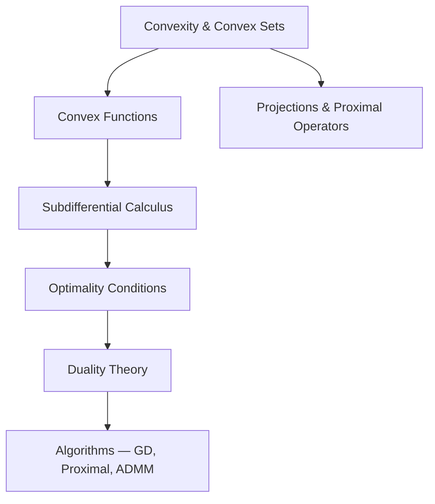

# Optimization MOC

> Map of Content — **Mathematical Optimization**

## Subareas

- [[Convex Optimization MOC]]
- Nonsmooth Optimization
- Optimal Control
- Numerical Optimization

---

## Foundations



---

## Core Concepts

```dataview
TABLE topic, status
FROM "01_Concepts"
WHERE area = "Optimization"
SORT file.name ASC
```

## Key Theorems & Results

```dataview
TABLE topic, source, status
FROM "04_Foundations"
WHERE area = "Optimization"
SORT file.name ASC
```

## Papers

```dataview
TABLE authors, year, status, rating
FROM "02_Papers"
WHERE area = "Optimization"
SORT year DESC
```

## Open Problems

```dataview
TABLE difficulty, status
FROM "03_Projects"
WHERE area = "Optimization"
SORT status ASC
```

## Key Topics to Cover

- [ ] Convex sets: cones, polyhedra, epigraphs
- [ ] Convex functions: proper, closed, coercive
- [ ] Subdifferential and subgradients
- [ ] KKT conditions, Slater's condition
- [ ] Lagrangian duality, strong duality
- [ ] Proximal operators and Moreau envelope
- [ ] Gradient descent, proximal gradient, ADMM
- [ ] Optimal control: Pontryagin, Hamilton-Jacobi

## Key References

- Boyd & Vandenberghe — *Convex Optimization*
- Rockafellar — *Convex Analysis*
- Bauschke & Combettes — *Convex Analysis and Monotone Operator Theory*
- Nocedal & Wright — *Numerical Optimization*

---
*Last updated: 2026-04-13*
