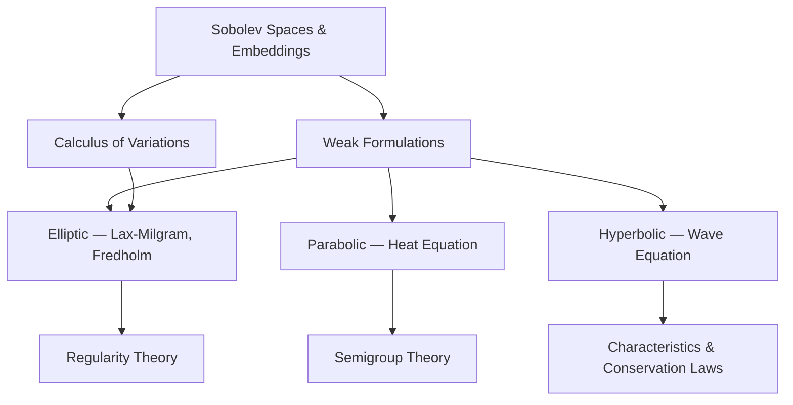

# PDE MOC

> Map of Content — **Partial Differential Equations**

## Subareas

- Elliptic PDEs
- Parabolic PDEs
- Hyperbolic PDEs
- Variational Methods
- Functional Analysis for PDEs (Sobolev Spaces)

---

## Foundations



---

## Core Concepts

```dataview
TABLE topic, status
FROM "01_Concepts"
WHERE area = "PDEs"
SORT file.name ASC
```

## Key Theorems & Results

```dataview
TABLE topic, source, status
FROM "04_Foundations"
WHERE area = "PDEs"
SORT file.name ASC
```

## Papers

```dataview
TABLE authors, year, status, rating
FROM "02_Papers"
WHERE area = "PDEs"
SORT year DESC
```

## Open Problems

```dataview
TABLE difficulty, status
FROM "03_Projects"
WHERE area = "PDEs"
SORT status ASC
```

## Key Topics to Cover

- [ ] Distributions and weak derivatives
- [ ] Sobolev spaces $W^{k,p}$, $H^k$
- [ ] Sobolev embedding and trace theorems
- [ ] Lax-Milgram theorem and weak solutions
- [ ] Elliptic regularity (interior & boundary)
- [ ] Maximum principles (weak, strong, Hopf)
- [ ] Heat equation: fundamental solution, energy methods
- [ ] Wave equation: energy conservation, characteristics
- [ ] Calculus of variations: Euler-Lagrange, direct method
- [ ] Semigroup theory: $C_0$-semigroups, Hille-Yosida

## Key References

- Evans — *Partial Differential Equations*
- Brezis — *Functional Analysis, Sobolev Spaces and PDEs*
- Gilbarg & Trudinger — *Elliptic PDEs of Second Order*
- Salsa — *Partial Differential Equations in Action*

---
*Last updated: 2026-04-13*
