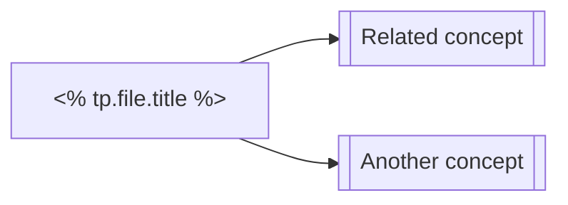

# <% tp.file.title %>

## Definition

> **Definition** *(informal name).*
> Let ... Then ...
>
> $$
> \text{(formal definition)}
> $$

## Intuition

> [!note] Mental Model
> 

## Key Properties

- **Property 1:**
- **Property 2:**

## Examples

### Example 1

$$
\text{(concrete example)}
$$

### Counter-example

$$
\text{(what fails without a condition)}
$$

## Relation to Other Concepts

| Concept | Relation |
|---------|----------|
| [[]]    |          |

## Theorems Involving This Concept

- [[]] —

## Notation

| Symbol | Meaning |
|--------|---------|
|        |         |

## References

- 

---
*Created: <% tp.date.now("YYYY-MM-DD") %>*
