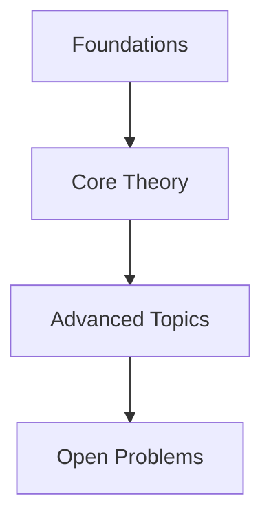

# <% tp.file.title %>

> Map of Content for **<% tp.file.title %>**

## Core Concepts

```dataview
TABLE topic, status
FROM "01_Concepts"
WHERE area = this.area
SORT file.name ASC
```

## Key Theorems & Results

```dataview
TABLE topic, source, status
FROM "04_Foundations"
WHERE area = this.area
SORT file.name ASC
```

## Papers

```dataview
TABLE authors, year, status, rating
FROM "02_Papers"
WHERE area = this.area
SORT year DESC
```

## Open Problems

```dataview
TABLE difficulty, status
FROM "03_Projects"
WHERE area = this.area
SORT status ASC
```

## Roadmap / Learning Path



## External References

- 

---
*Last updated: <% tp.date.now("YYYY-MM-DD") %>*
